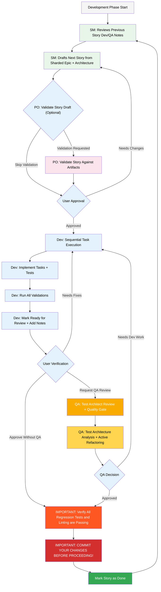

# BMad-Method BMAd Code User Guide

This guide will help you understand and effectively use the BMad Method for agile AI driven planning and development.

## The BMad Plan and Execute Workflow

First, here is the full standard Greenfield Planning + Execution Workflow. Brownfield is very similar, but it's suggested to understand this greenfield first, even if on a simple project before tackling a brownfield project. The BMad Method needs to be installed to the root of your new project folder. For the planning phase, you can optionally perform it with powerful web agents, potentially resulting in higher quality results at a fraction of the cost it would take to complete if providing your own API key or credits in some Agentic tools. For planning, powerful thinking models and larger context - along with working as a partner with the agents will net the best results.

If you are going to use the BMad Method with a Brownfield project (an existing project), review **[Working in the Brownfield](./working-in-the-brownfield.md)**.

If you do not see the diagrams that following rendering, you can install Markdown All in One along with the Markdown Preview Mermaid Support plugins to VSCode (or one of the forked clones). With these plugin's, if you right click on the tab when open, there should be a Open Preview option, or check the IDE documentation.

### The Planning Workflow (Web UI or Powerful IDE Agents)

Before development begins, BMad follows a structured planning workflow that's ideally done in web UI for cost efficiency:

```mermaid
graph TD
    A["Start: Project Idea"] --> B{"Optional: Analyst Research"}
    B -->|Yes| C["Analyst: Brainstorming (Optional)"]
    B -->|No| G{"Project Brief Available?"}
    C --> C2["Analyst: Market Research (Optional)"]
    C2 --> C3["Analyst: Competitor Analysis (Optional)"]
    C3 --> D["Analyst: Create Project Brief"]
    D --> G
    G -->|Yes| E["PM: Create PRD from Brief (Fast Track)"]
    G -->|No| E2["PM: Interactive PRD Creation (More Questions)"]
    E --> F["PRD Created with FRs, NFRs, Epics & Stories"]
    E2 --> F
    F --> F2{"UX Required?"}
    F2 -->|Yes| F3["UX Expert: Create Front End Spec"]
    F2 -->|No| H["Architect: Create Architecture from PRD"]
    F3 --> F4["UX Expert: Generate UI Prompt for Lovable/V0 (Optional)"]
    F4 --> H2["Architect: Create Architecture from PRD + UX Spec"]
    H --> I["PO: Run Master Checklist"]
    H2 --> I
    I --> J{"Documents Aligned?"}
    J -->|Yes| K["Planning Complete"]
    J -->|No| L["PO: Update Epics & Stories"]
    L --> M["Update PRD/Architecture as needed"]
    M --> I
    K --> N["📁 Switch to IDE (If in a Web Agent Platform)"]
    N --> O["PO: Shard Documents"]
    O --> P["Ready for SM/Dev Cycle"]

    style A fill:#f5f5f5,color:#000
    style B fill:#e3f2fd,color:#000
    style C fill:#e8f5e9,color:#000
    style C2 fill:#e8f5e9,color:#000
    style C3 fill:#e8f5e9,color:#000
    style D fill:#e8f5e9,color:#000
    style E fill:#fff3e0,color:#000
    style E2 fill:#fff3e0,color:#000
    style F fill:#fff3e0,color:#000
    style F2 fill:#e3f2fd,color:#000
    style F3 fill:#e1f5fe,color:#000
    style F4 fill:#e1f5fe,color:#000
    style G fill:#e3f2fd,color:#000
    style H fill:#f3e5f5,color:#000
    style H2 fill:#f3e5f5,color:#000
    style I fill:#f9ab00,color:#fff
    style J fill:#e3f2fd,color:#000
    style K fill:#34a853,color:#fff
    style L fill:#f9ab00,color:#fff
    style M fill:#fff3e0,color:#000
    style N fill:#1a73e8,color:#fff
    style O fill:#f9ab00,color:#fff
    style P fill:#34a853,color:#fff
```



#### Web UI to IDE Transition

**Critical Transition Point**: Once the PO confirms document alignment, you must switch from web UI to IDE to begin the development workflow:

1. **Copy Documents to Project**: Ensure `docs/prd.md` and `docs/architecture.md` are in your project's docs folder (or a custom location you can specify during installation)
2. **Switch to IDE**: Open your project in your preferred Agentic IDE
3. **Document Sharding**: Use the PO agent to shard the PRD and then the Architecture
4. **Begin Development**: Start the Core Development Cycle that follows

### The Core Development Cycle (IDE)

Once planning is complete and documents are sharded, BMad follows a structured development workflow:



## Installation

### Optional

If you want to do the planning in the Web with Claude (Sonnet 4 or Opus), Gemini Gem (2.5 Pro), or Custom GPT's:

1. Navigate to `dist/teams/`
2. Copy `team-fullstack.txt`
3. Create new Gemini Gem or CustomGPT
4. Upload file with instructions: "Your critical operating instructions are attached, do not break character as directed"
5. Type `/help` to see available commands

### IDE Project Setup

```bash
# Interactive installation (recommended)
npx bmad-method install
```

## Special Agents

There are two bmad agents - in the future they will be consolidated into the single bmad-master.

### BMad-Master

This agent can do any task or command that all other agents can do, aside from actual story implementation. Additionally, this agent can help explain the BMad Method when in the web by accessing the knowledge base and explaining anything to you about the process.

If you don't want to bother switching between different agents aside from the dev, this is the agent for you. Just remember that as the context grows, the performance of the agent degrades, therefore it is important to instruct the agent to compact the conversation and start a new conversation with the compacted conversation as the initial message. Do this often, preferably after each story is implemented.

### BMad-Orchestrator

This agent should NOT be used within the IDE, it is a heavy weight special purpose agent that utilizes a lot of context and can morph into any other agent. This exists solely to facilitate the team's within the web bundles. If you use a web bundle you will be greeted by the BMad Orchestrator.

### How Agents Work

#### Dependencies System

Each agent has a YAML section that defines its dependencies:

```yaml
dependencies:
  templates:
    - prd-template.md
    - user-story-template.md
  tasks:
    - create-doc.md
    - shard-doc.md
  data:
    - bmad-kb.md
```

**Key Points:**

- Agents only load resources they need (lean context)
- Dependencies are automatically resolved during bundling
- Resources are shared across agents to maintain consistency

#### Agent Interaction

**In IDE:**

```bash
# Some Ide's, like Cursor or Windsurf for example, utilize manual rules so interaction is done with the '@' symbol
@pm Create a PRD for a task management app
@architect Design the system architecture
@dev Implement the user authentication

# Some, like Claude Code use slash commands instead
/pm Create user stories
/dev Fix the login bug
```

#### Interactive Modes

- **Incremental Mode**: Step-by-step with user input
- **YOLO Mode**: Rapid generation with minimal interaction

## IDE Integration

### IDE Best Practices

- **Context Management**: Keep relevant files only in context, keep files as lean and focused as necessary
- **Agent Selection**: Use appropriate agent for task
- **Iterative Development**: Work in small, focused tasks
- **File Organization**: Maintain clean project structure
- **Commit Regularly**: Save your work frequently

## The Test Architect (QA Agent)

### Overview

The QA agent in BMad is not just a "senior developer reviewer" - it's a **Test Architect** with deep expertise in test strategy, quality gates, and risk-based testing. Named Quinn, this agent provides advisory authority on quality matters while actively improving code when safe to do so.

### Core Capabilities

#### 1. Comprehensive Test Architecture Review

When you run `@qa *review {story}`, Quinn performs:

- **Requirements Traceability**: Maps every acceptance criterion to its validating tests
- **Test Level Analysis**: Ensures appropriate testing at unit, integration, and E2E levels
- **Coverage Assessment**: Identifies gaps and redundant test coverage
- **Active Refactoring**: Improves code quality directly when safe
- **Quality Gate Decision**: Issues PASS/CONCERNS/FAIL status based on findings

#### 2. Test Design (`*design`)

Creates comprehensive test strategies including:

- Test scenarios for each acceptance criterion
- Appropriate test level recommendations (unit vs integration vs E2E)
- Risk-based prioritization (P0/P1/P2)
- Test data requirements and mock strategies
- Execution strategies for CI/CD integration

**Example output:**

```yaml
test_summary:
  total: 24
  by_level:
    unit: 15
    integration: 7
    e2e: 2
  by_priority:
    P0: 8 # Must have - linked to critical risks
    P1: 10 # Should have - medium risks
    P2: 6 # Nice to have - low risks
```

#### 3. Risk Profiling (`*risk`)

Identifies and assesses implementation risks:

- **Categories**: Technical, Security, Performance, Data, Business, Operational
- **Scoring**: Probability × Impact analysis (1-9 scale)
- **Mitigation**: Specific strategies for each identified risk
- **Gate Impact**: Risks ≥9 trigger FAIL, ≥6 trigger CONCERNS

#### 4. NFR Assessment (`*nfr`)

Validates non-functional requirements:

- **Core Four**: Security, Performance, Reliability, Maintainability
- **Evidence-Based**: Looks for actual implementation proof
- **Gate Integration**: NFR failures directly impact quality gates

#### 5. Requirements Tracing (`*trace`)

Maps requirements to test coverage:

- Documents which tests validate each acceptance criterion
- Uses Given-When-Then for clarity (documentation only, not BDD code)
- Identifies coverage gaps with severity ratings
- Creates traceability matrix for audit purposes

#### 6. Quality Gates (`*gate`)

Manages quality gate decisions:

- **Deterministic Rules**: Clear criteria for PASS/CONCERNS/FAIL
- **Parallel Authority**: QA owns gate files in `docs/qa/gates/`
- **Advisory Nature**: Provides recommendations, not blocks
- **Waiver Support**: Documents accepted risks when needed

### Working with the Test Architect

#### Basic Review Flow

1. **Developer completes story** and marks "Ready for Review"
2. **Start new conversation** with QA agent
3. **Run review**: `@qa *review {story-file}`
4. **Quinn performs**:
   - Deep code analysis
   - Active refactoring where safe
   - Test coverage validation
   - Quality gate decision
5. **Outputs created**:
   - QA Results section added to story file
   - Gate file in `docs/qa/gates/{epic}.{story}-{slug}.yml`

#### Advanced Quality Assessments - When to Use

**AFTER Story Draft (Before Dev Starts):**

```bash
# Design test strategy BEFORE implementation
@qa *design {draft-story}
# Output: docs/qa/assessments/{epic}.{story}-test-design-{YYYYMMDD}.md
# Why: Guides developer on what tests to write

# Identify risks EARLY to guide implementation
@qa *risk {draft-story}
# Output: docs/qa/assessments/{epic}.{story}-risk-{YYYYMMDD}.md
# Why: Helps developer avoid pitfalls and focus on risk areas
```

**DURING Development (Mid-Implementation):**

```bash
# Validate NFR implementation as you build
@qa *nfr {in-progress-story}
# Output: docs/qa/assessments/{epic}.{story}-nfr-{YYYYMMDD}.md
# Why: Catch performance/security issues early

# Check test coverage while developing
@qa *trace {in-progress-story}
# Output: docs/qa/assessments/{epic}.{story}-trace-{YYYYMMDD}.md
# Why: Ensure you're writing the right tests
```

**AFTER Review (Post-Implementation):**

```bash
# Update gate decision after fixes
@qa *gate {reviewed-story}
# Output: docs/qa/gates/{epic}.{story}-{slug}.yml
# Why: Document final quality decision
```

### Quality Standards Enforced

Quinn enforces these test quality principles:

- **No Flaky Tests**: Ensures reliability through proper async handling
- **No Hard Waits**: Dynamic waiting strategies only
- **Stateless & Parallel-Safe**: Tests run independently
- **Self-Cleaning**: Tests manage their own test data
- **Appropriate Test Levels**: Unit for logic, integration for interactions, E2E for journeys
- **Explicit Assertions**: Keep assertions in tests, not helpers

### Gate Status Meanings

- **PASS**: All critical requirements met, no blocking issues
- **CONCERNS**: Non-critical issues found, team should review
- **FAIL**: Critical issues that should be addressed (security risks, missing P0 tests)
- **WAIVED**: Issues acknowledged but explicitly accepted by team

### Integration with Development Flow

The Test Architect integrates seamlessly:

1. **Planning Phase**: Can review test strategies early
2. **Development Phase**: Developer implements with test guidelines in mind
3. **Review Phase**: Comprehensive quality assessment
4. **Gate Decision**: Clear go/no-go recommendation
5. **Documentation**: All findings tracked for audit trail

### Integration with BMad Workflow Stages

#### Stage 1: Story Drafting (SM Creates Story)

**Optional but Valuable:**

- Run `*design` on draft → Give to Dev as test requirements
- Run `*risk` on draft → Highlight concerns for Dev to address

#### Stage 2: Development (Dev Implements)

**Mid-Development Checkpoints:**

- Dev can run `*trace` → Verify tests are being created
- Dev can run `*nfr` → Check performance/security early

#### Stage 3: Review (Story Ready)

**Standard Review:**

- Run `*review` → Complete assessment + gate decision

**If Issues Found:**

- After fixes, run `*gate` → Update gate status

#### Special Situations

**High-Risk Stories:**

- Always run `*risk` and `*design` before development

**Complex Integrations:**

- Run `*trace` to ensure all integration points tested

**Performance-Critical:**

- Run `*nfr` during development, not just at review

### Best Practices

- **Early Engagement**: Run `*design` and `*risk` during story drafting
- **Risk-Based Focus**: Let risk scores drive test prioritization
- **Iterative Improvement**: Use QA feedback to improve future stories
- **Gate Transparency**: Share gate decisions with the team
- **Continuous Learning**: QA documents patterns for team knowledge sharing
- **Brownfield Care**: Pay extra attention to regression risks in existing systems

## Technical Preferences System

BMad includes a personalization system through the `technical-preferences.md` file located in `.bmad-core/data/` - this can help bias the PM and Architect to recommend your preferences for design patterns, technology selection, or anything else you would like to put in here.

### Using with Web Bundles

When creating custom web bundles or uploading to AI platforms, include your `technical-preferences.md` content to ensure agents have your preferences from the start of any conversation.

## Core Configuration

The `bmad-core/core-config.yaml` file is a critical config that enables BMad to work seamlessly with differing project structures, more options will be made available in the future. Currently the most important is the devLoadAlwaysFiles list section in the yaml.

### Developer Context Files

Define which files the dev agent should always load:

```yaml
devLoadAlwaysFiles:
  - docs/architecture/coding-standards.md
  - docs/architecture/tech-stack.md
  - docs/architecture/project-structure.md
```

You will want to verify from sharding your architecture that these documents exist, that they are as lean as possible, and contain exactly the information you want your dev agent to ALWAYS load into it's context. These are the rules the agent will follow.

As your project grows and the code starts to build consistent patterns, coding standards should be reduced to include only the standards that the agent still makes with. The agent will look at surrounding code in files to infer the coding standards that are relevant to the current task.

## Getting Help

- **Discord Community**: [Join Discord](https://discord.gg/gk8jAdXWmj)
- **GitHub Issues**: [Report bugs](https://github.com/bmadcode/bmad-method/issues)
- **Documentation**: [Browse docs](https://github.com/bmadcode/bmad-method/docs)
- **YouTube**: [BMadCode Channel](https://www.youtube.com/@BMadCode)

## Conclusion

Remember: BMad is designed to enhance your development process, not replace your expertise. Use it as a powerful tool to accelerate your projects while maintaining control over design decisions and implementation details.
